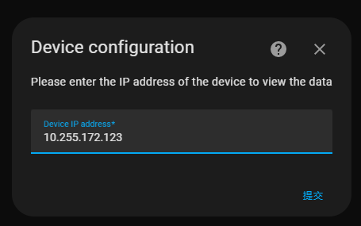

# Home Assistant - WittIOT
 

 
This integration is used to display weather data for ecowitt's gateway devices.

## :computer: Installation

### HACS (Preferred)
This integration can be added to Home Assistant as a [custom HACS repository](https://hacs.xyz/docs/faq/custom_repositories):
1. From the HACS page, click the 3 dots at the top right corner.
1. Select `Custom repositories`.
1. Add the URL `https://github.com/PPw096/ha-wittiot`
1. Select the category `Integration`.
1. Click the ADD button.
1. Restart Home Assistant
1. Click the button below, or in the HA UI go to "Configuration" -> "Integrations" click "+" and search for "WittIOT"

### Manual
1. Download the latest release from [here](https://github.com/PPw096/ha-wittiot/releases).
1. Create a folder called `custom_components` in the same directory as the Home Assistant `configuration.yaml`.
1. Extract the contents of the zip into folder called `wittiot` inside `custom_components`.
1. Restart Home Assistant
1. Click the button below, or in the HA UI go to "Configuration" -> "Integrations" click "+" and search for "WittIOT"

## :bulb: Usage
1. The following steps must be performed to set up this integration.
1. Configure gateway devices to your LAN using the ws view plus or ecowitt app on your phone and then view the device IP address.
1. Enter the IP address of the device in the integration, and the integration will obtain the data of the gateway device after a successful connection.

